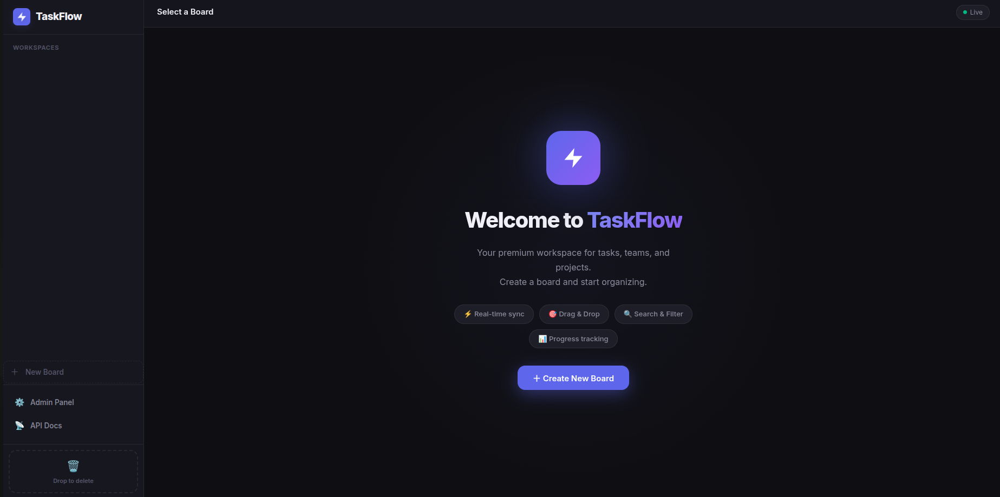
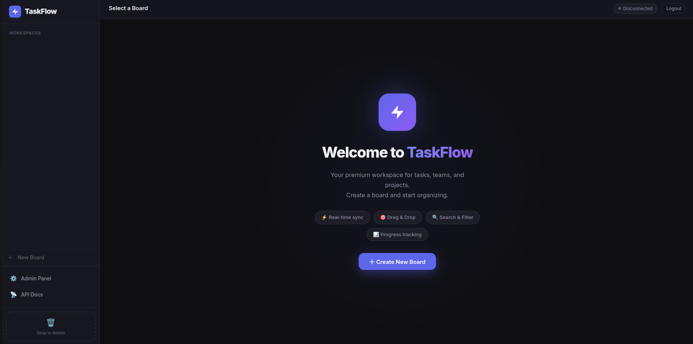

# ⚡ TaskFlow — Premium Kanban Management System

<div align="center">
  
</div>

TaskFlow is a high-performance, real-time task management application inspired by Notion's clean aesthetics and Jira's functional power. Built with a modern full-stack architecture, it demonstrates the seamless integration of asynchronous backend services with a reactive frontend.
## 🚀 Key Features

- **Real-time Collaboration**: Instant task updates across all connected clients via WebSockets (Django Channels).
- **Dynamic Kanban Engine**: Smooth, performant drag-and-drop task movement between columns.
- **Bulk Operations & Drag-to-Delete**: Multi-select items and drag them to the Trash zone to delete multiple tasks, columns, or entire boards instantly.
- **Premium Design System**: A custom-built, dark-mode CSS architecture featuring glassmorphism, glowing micro-interactions, full-screen empty states, and fluid transitions.
- **Multi-Workspace Management**: Create, edit, and organize multiple boards for different projects, each with custom colors that reflect throughout the UI.
- **Rich Task Metadata**: Categorize tasks with priorities (Low to Urgent), labels (Bug, Feature, etc.), and due dates.
- **Auto-Seeding**: Get started instantly with a sample workspace populated with realistic project data.

## 📸 Screenshots

### The Kanban Board

*TaskFlow's full-screen Kanban board with a glassmorphism toolbar, task multi-select, and workspace accent colors.*

### Premium Welcome Screen

*The animated, full-screen welcome view when no boards are selected.*

## 🛠️ Technology Stack

### Backend (`taskflow_api`)
- **Django**: Robust Python framework for the core logic.
- **Django REST Framework (DRF)**: High-quality RESTful API endpoints.
- **Django Channels**: Asynchronous WebSocket handling for real-time sync.
- **Daphne**: High-performance ASGI server for production-ready async support.
- **SQLite**: Lightweight, zero-config database (can be easily swapped for PostgreSQL).

### Frontend (`taskflow_web`)
- **Vue 3 (Composition API)**: Modern, reactive frontend architecture.
- **Vite**: Ultra-fast build tool and development server.
- **VueDraggable (vue-draggable-plus)**: Reliable, accessible drag-and-drop engine.
- **Axios**: Clean HTTP client for API communication.
- **Vanilla CSS**: Bespoke design system without the overhead of heavy frameworks.

## 📁 Project Structure

```text
taskflow_project/
├── taskflow_api/         # Django Backend
│   ├── core/             # Project settings & ASGI/WS config
│   ├── tasks/            # Task management app (Models, Views, WS Consumers)
│   └── manage.py
├── taskflow_web/         # Vue Frontend
│   ├── src/
│   │   ├── components/   # Modular Vue components
│   │   ├── services/     # API & WebSocket abstraction layers
│   │   ├── App.vue       # Main application shell
│   │   └── style.css     # Premium design system
│   └── package.json
└── venv/                 # Shared Python Virtual Environment
```

## ⚙️ Setup & Installation

### 1. Backend Setup
```bash
# Enter backend directory
cd taskflow_api

# Install dependencies
pip install -r requirements.txt

# Run migrations
python manage.py migrate

# Start the ASGI server
daphne -b 0.0.0.0 -p 8000 taskflow_api.asgi:application
```

### 2. Frontend Setup
```bash
# Enter frontend directory
cd taskflow_web

# Install dependencies
npm install

# Start the development server
npm run dev
```

## 📜 License
This project is for demonstration purposes. Feel free to use and extend it!
